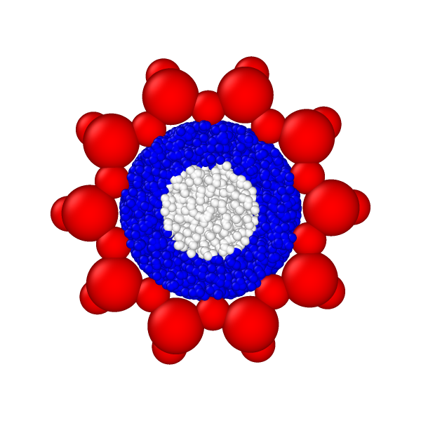

# Creating a figure to visualize the inside and outside points

In this example I create a figure like the one below:



Beware that the more points you put in your figure, the slowest the trajectory script runs! In this example I'm using 1000, that in this case is enough.

Using the files in this folder, follow the steps:
1. run `volume.in` to get the interaction energies
2. grep the interaction energies with
```bash
grep "Loop time of" volume.out -B1 --no-group-separator | grep -v "Loop time of" | awk '{print $3}' > inten.txt
```
3. using **the same** `rngs.txt` run `volume_traj.in`, which will generate the `debug.lammpstrj`
4. use the `concat_in_out_traj.py` script to get the last configuration (configuration 1000) from `debug.lammpstrj` (which contains all the inserted Ne atoms) and color accordingly
```bash
python ../concat_in_out_traj.py debug.lammpstrj inten.txt 1000 > colored.lammpstrj
```
5. open `colored.lammpstrj` with ovito, add a "Color coding" modification and color the atoms by the "inside" property.
6. to have a better visualization you can reduce the radii of the Ne atoms
